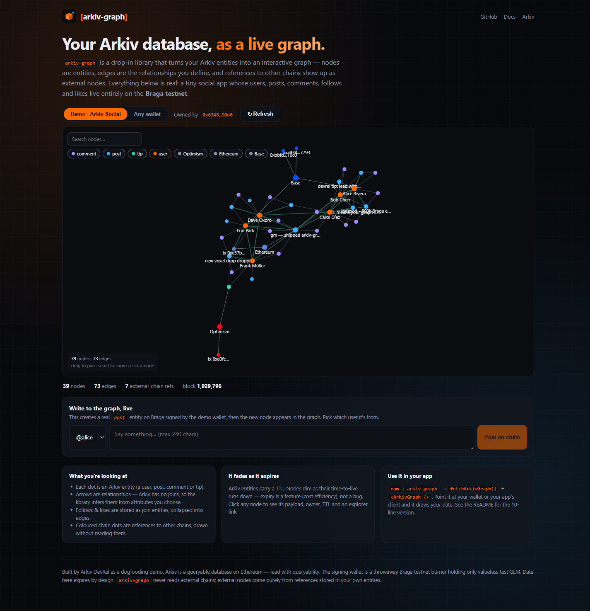

# arkiv-graph

**See your [Arkiv](https://docs.arkiv.network) database as a live graph.** A drop-in library + a real, on-chain showcase.

- 📦 **Library** ([`packages/arkiv-graph`](./packages/arkiv-graph)) — `npm i arkiv-graph`. Turns Arkiv entities into an interactive force-directed graph. Nodes are entities; edges are the relationships you define; references to other chains appear as external nodes (drawn without reading those chains).
- 🌐 **Showcase** ([`apps/example`](./apps/example)) — **https://arkiv-graph-example.vercel.app**. A tiny social app (users, posts, comments, follows, likes) stored **entirely on the Braga testnet**, visualized with the library. Includes a live "write a post on-chain" button.



## Why

The Arkiv entity explorer is a flat list — you can't *see* how records relate or spot clusters. And because Arkiv has no joins, the data model is invisible until you draw it. `arkiv-graph` makes the relationships you've designed visible, debuggable, and demoable — and shows where your data reaches into other chains.

## Monorepo layout

```
arkiv-graph/
├─ packages/arkiv-graph/   # the published library (core + /react)
│  ├─ src/                 # buildGraph, link rules, external detection, fetch, <ArkivGraph>
│  └─ README.md            # ← library docs (install, API, link-rule cookbook)
├─ apps/example/           # the Next.js showcase (arkiv-graph-example.vercel.app)
│  ├─ src/app/             # page, showcase client, /api/graph (read), /api/post (live write)
│  ├─ src/lib/             # Arkiv clients + link config + write guards
│  └─ scripts/seed.mjs     # seeds the social demo into Braga (one batch tx)
└─ docs/
```

## Develop

```bash
pnpm install
pnpm build:lib                 # build the library (tsup → dist)
pnpm test                      # library unit tests (vitest)

# showcase:
cp apps/example/.env.local.example apps/example/.env.local   # add a Braga burner PRIVATE_KEY
pnpm seed                      # seed the demo into Braga (skips if already seeded; --reseed to rebuild)
pnpm dev                       # → http://localhost:3012
```

The signing wallet is a **throwaway Braga testnet burner** holding only valueless test GLM. Never use a mainnet key. Get test GLM at the [Braga faucet](https://braga.hoodi.arkiv.network/faucet/).

## Library in 10 lines

```tsx
import { fetchArkivGraph } from "arkiv-graph";
import { ArkivGraph } from "arkiv-graph/react";

const { graph } = await fetchArkivGraph({
  project: "my-app",
  createdBy: "0xYourWallet",
  links: [
    { type: "reference", attribute: "authorKey", targetType: "user", label: "by" },
    { type: "join", entityType: "like", sourceAttr: "userKey", targetAttr: "postKey", label: "likes" },
  ],
});
// <ArkivGraph data={graph} height={600} />
```

Full docs: [`packages/arkiv-graph/README.md`](./packages/arkiv-graph/README.md) · LLM integration guide: [`AGENTS.md`](./AGENTS.md).

## License

MIT © Arkiv DevRel
